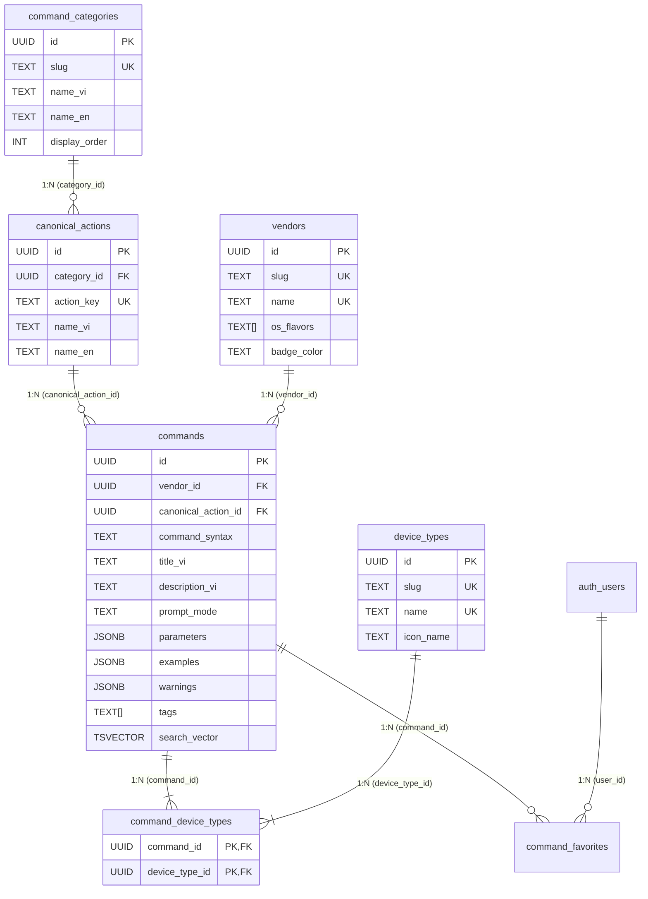

# Phase 1: Database Foundation & Auth - Pattern Analysis

**Generated:** 2026-08-18  
**Phase:** 1 — Database Foundation & Auth  
**Target Directory:** `supabase/migrations/` & `scripts/`

---

## 1. Overview & File Mapping

Phase 1 establishes the PostgreSQL backend on Supabase for the Network Command Lookup Tool. This document maps each file to be created or modified against existing codebase conventions and architectural standards.

### 1.1 Target Files

| Target File | Classification / Role | Purpose | Primary Codebase Analog |
|-------------|----------------------|---------|-------------------------|
| `supabase/migrations/001_create_schema.sql` | **DDL Migration (Schema & Security)** | Extensions, immutable normalizers, 6 relational tables, GIN/B-Tree indexes, RLS policies (DB-01..DB-06, DB-08, DB-09) | `src/lib/supabaseClient.js`, `src/pages/Docs.jsx` (table schemas) |
| `supabase/migrations/002_search_rpc.sql` | **Logic Migration (PL/pgSQL RPC)** | Hybrid search RPC function (`search_network_commands`) & batch import helper (DB-07) | Supabase RPC SDK pattern, `src/pages/Tools.jsx` (query aggregation) |
| `supabase/migrations/003_seed_data.sql` | **DML Migration (Seed Reference Data)** | Seeds 7 vendors, 4 device types, 8 categories, canonical actions, and 50–70 representative commands | `INITIAL_TOOLS` in `src/pages/Tools.jsx`, `SEED_DOCS` in `src/pages/Docs.jsx` |
| `scripts/verify_phase1.js` | **Automation / Verification Script** | Node.js script asserting DB-01 through DB-09, RLS isolation, and <50ms search latency | `src/lib/supabaseClient.js`, `src/context/AuthContext.jsx` |

---

## 2. File-by-File Pattern Analysis

```
                                  DATA FLOW ARCHITECTURE
                                  
 ┌───────────────────────┐
 │ `scripts/verify_phase1.js` ◄────┐
 └───────────┬───────────┘         │ (Executes Validation / RLS Checks)
             │                     │
             ▼ (Invokes Supabase RPC & Client Queries)
 ┌─────────────────────────────────┴─────────────────────────────────┐
 │                     Supabase PostgreSQL Backend                   │
 │                                                                   │
 │  ┌─────────────────────────────────────────────────────────────┐  │
 │  │ 001_create_schema.sql                                       │  │
 │  │ - Extensions: pg_trgm, unaccent                             │  │
 │  │ - Immutable normalizers: immutable_unaccent, array_to_string│  │
 │  │ - Tables: vendors, device_types, command_categories,        │  │
 │  │           canonical_actions, commands, command_device_types │  │
 │  │ - TSVECTOR STORED generated column & GIN trigram indexes    │  │
 │  │ - Row Level Security (RLS) policies                         │  │
 │  └──────────────────────────────┬──────────────────────────────┘  │
 │                                 │                                 │
 │  ┌──────────────────────────────▼──────────────────────────────┐  │
 │  │ 002_search_rpc.sql                                          │  │
 │  │ - search_network_commands(p_query, p_vendor_id, ...)        │  │
 │  │ - JSON aggregation: jsonb_build_object, jsonb_agg           │  │
 │  │ - Hybrid relevance formula: exact + tsvector + trigram      │  │
 │  │ - import_network_commands_batch(...)                        │  │
 │  └──────────────────────────────┬──────────────────────────────┘  │
 │                                 │                                 │
 │  ┌──────────────────────────────▼──────────────────────────────┐  │
 │  │ 003_seed_data.sql                                           │  │
 │  │ - 7 Vendors (Cisco, Fortinet, Juniper, Palo Alto, ...)      │  │
 │  │ - 4 Device Types (Switch, Router, Firewall, AP/WLC)         │  │
 │  │ - 8 Categories (interface-port, vlan, routing, ...)         │  │
 │  │ - 15+ Canonical Action slugs (vlan.create, ...)             │  │
 │  │ - 50–70 Network CLI commands with JSONB params & examples   │  │
 │  └─────────────────────────────────────────────────────────────┘  │
 └───────────────────────────────────────────────────────────────────┘
```

---

### 2.1 File: `supabase/migrations/001_create_schema.sql`

#### Role & Responsibility
- **Role:** DDL Migration & Database Foundation
- **Responsibility:**
  1. Activates required PostgreSQL extensions (`pg_trgm`, `unaccent`).
  2. Creates `IMMUTABLE` wrappers for `unaccent` and `array_to_string` to avoid PostgreSQL `STABLE` function restriction in generated columns and indexes.
  3. Creates all 6 core relational tables plus `command_favorites`.
  4. Configures `search_vector` generated column with weighted text concatenation (`setweight`).
  5. Creates GIN indexes for TSVECTOR and Trigram operations, plus B-Tree indexes for foreign keys.
  6. Enables Row Level Security (RLS) and attaches `authenticated`-only read and manage policies.

#### Existing Analog in Codebase
The existing codebase interacts with Supabase tables like `tools`, `docs`, `folders` (e.g., [Tools.jsx:L221-224](file:///C:/Users/O5A00001315/Desktop/KhacNghia/src/pages/Tools.jsx#L221-L224) and [Docs.jsx:L1101-1104](file:///C:/Users/O5A00001315/Desktop/KhacNghia/src/pages/Docs.jsx#L1101-L1104)).

#### Concrete Implementation Patterns

```sql
-- 1. EXTENSIONS & IMMUTABLE WRAPPERS
CREATE EXTENSION IF NOT EXISTS "pg_trgm";
CREATE EXTENSION IF NOT EXISTS "unaccent";

CREATE OR REPLACE FUNCTION immutable_unaccent(text)
RETURNS text AS $$
    SELECT public.unaccent('public.unaccent', $1);
$$ LANGUAGE sql IMMUTABLE PARALLEL SAFE STRICT;

CREATE OR REPLACE FUNCTION immutable_array_to_string(text[], text)
RETURNS text AS $$
    SELECT array_to_string($1, $2);
$$ LANGUAGE sql IMMUTABLE PARALLEL SAFE STRICT;

-- 2. RELATIONAL TABLES
CREATE TABLE IF NOT EXISTS vendors (
    id UUID PRIMARY KEY DEFAULT gen_random_uuid(),
    name TEXT NOT NULL UNIQUE,
    slug TEXT NOT NULL UNIQUE,
    os_flavors TEXT[] NOT NULL DEFAULT '{}',
    icon_name TEXT,
    badge_color TEXT,
    display_order INT NOT NULL DEFAULT 0,
    created_at TIMESTAMPTZ NOT NULL DEFAULT now()
);

CREATE TABLE IF NOT EXISTS device_types (
    id UUID PRIMARY KEY DEFAULT gen_random_uuid(),
    name TEXT NOT NULL UNIQUE,
    slug TEXT NOT NULL UNIQUE,
    icon_name TEXT,
    description_vi TEXT,
    display_order INT NOT NULL DEFAULT 0,
    created_at TIMESTAMPTZ NOT NULL DEFAULT now()
);

CREATE TABLE IF NOT EXISTS command_categories (
    id UUID PRIMARY KEY DEFAULT gen_random_uuid(),
    name_vi TEXT NOT NULL,
    name_en TEXT NOT NULL,
    slug TEXT NOT NULL UNIQUE,
    description_vi TEXT,
    icon_name TEXT,
    parent_id UUID REFERENCES command_categories(id) ON DELETE SET NULL,
    display_order INT NOT NULL DEFAULT 0,
    created_at TIMESTAMPTZ NOT NULL DEFAULT now()
);

CREATE TABLE IF NOT EXISTS canonical_actions (
    id UUID PRIMARY KEY DEFAULT gen_random_uuid(),
    category_id UUID NOT NULL REFERENCES command_categories(id) ON DELETE CASCADE,
    action_key TEXT NOT NULL UNIQUE, -- dot notation: vlan.create
    name_vi TEXT NOT NULL,
    name_en TEXT NOT NULL,
    description_vi TEXT,
    created_at TIMESTAMPTZ NOT NULL DEFAULT now()
);

CREATE TABLE IF NOT EXISTS commands (
    id UUID PRIMARY KEY DEFAULT gen_random_uuid(),
    vendor_id UUID NOT NULL REFERENCES vendors(id) ON DELETE CASCADE,
    canonical_action_id UUID REFERENCES canonical_actions(id) ON DELETE SET NULL,
    created_by UUID REFERENCES auth.users(id) ON DELETE SET NULL,
    command_syntax TEXT NOT NULL,
    full_syntax TEXT,
    prompt_mode TEXT,
    os_flavor TEXT,
    title_vi TEXT NOT NULL,
    description_vi TEXT NOT NULL,
    notes_vi TEXT,
    verification_command TEXT,
    rollback_command TEXT,
    is_destructive BOOLEAN NOT NULL DEFAULT FALSE,
    requires_commit BOOLEAN NOT NULL DEFAULT FALSE,
    is_verified BOOLEAN NOT NULL DEFAULT TRUE,
    tags TEXT[] NOT NULL DEFAULT '{}',
    parameters JSONB NOT NULL DEFAULT '[]'::jsonb,
    examples JSONB NOT NULL DEFAULT '[]'::jsonb,
    warnings JSONB NOT NULL DEFAULT '[]'::jsonb,
    created_at TIMESTAMPTZ NOT NULL DEFAULT now(),
    updated_at TIMESTAMPTZ NOT NULL DEFAULT now()
);

CREATE TABLE IF NOT EXISTS command_device_types (
    command_id UUID NOT NULL REFERENCES commands(id) ON DELETE CASCADE,
    device_type_id UUID NOT NULL REFERENCES device_types(id) ON DELETE CASCADE,
    PRIMARY KEY (command_id, device_type_id)
);

CREATE TABLE IF NOT EXISTS command_favorites (
    user_id UUID NOT NULL REFERENCES auth.users(id) ON DELETE CASCADE,
    command_id UUID NOT NULL REFERENCES commands(id) ON DELETE CASCADE,
    created_at TIMESTAMPTZ NOT NULL DEFAULT now(),
    PRIMARY KEY (user_id, command_id)
);

-- 3. TSVECTOR GENERATED COLUMN & INDEXES (DB-08)
ALTER TABLE commands ADD COLUMN IF NOT EXISTS search_vector tsvector GENERATED ALWAYS AS (
    setweight(to_tsvector('simple', coalesce(command_syntax, '')), 'A') ||
    setweight(to_tsvector('simple', immutable_unaccent(coalesce(title_vi, ''))), 'A') ||
    setweight(to_tsvector('simple', immutable_unaccent(coalesce(description_vi, ''))), 'B') ||
    setweight(to_tsvector('simple', coalesce(prompt_mode, '')), 'C') ||
    setweight(to_tsvector('simple', coalesce(verification_command, '')), 'C') ||
    setweight(to_tsvector('simple', immutable_unaccent(coalesce(notes_vi, ''))), 'D') ||
    setweight(to_tsvector('simple', immutable_unaccent(immutable_array_to_string(tags, ' '))), 'B')
) STORED;

CREATE INDEX IF NOT EXISTS idx_commands_search_vector ON commands USING gin (search_vector);
CREATE INDEX IF NOT EXISTS idx_commands_syntax_trgm ON commands USING gin (command_syntax gin_trgm_ops);
CREATE INDEX IF NOT EXISTS idx_commands_title_trgm ON commands USING gin (immutable_unaccent(title_vi) gin_trgm_ops);
CREATE INDEX IF NOT EXISTS idx_commands_desc_trgm ON commands USING gin (immutable_unaccent(description_vi) gin_trgm_ops);
CREATE INDEX IF NOT EXISTS idx_commands_vendor_id ON commands (vendor_id);
CREATE INDEX IF NOT EXISTS idx_commands_canonical_id ON commands (canonical_action_id);
CREATE INDEX IF NOT EXISTS idx_commands_tags ON commands USING gin (tags);
CREATE INDEX IF NOT EXISTS idx_command_device_types_device ON command_device_types (device_type_id);
CREATE INDEX IF NOT EXISTS idx_canonical_actions_category ON canonical_actions (category_id);

-- 4. ROW LEVEL SECURITY (DB-09)
ALTER TABLE vendors ENABLE ROW LEVEL SECURITY;
ALTER TABLE device_types ENABLE ROW LEVEL SECURITY;
ALTER TABLE command_categories ENABLE ROW LEVEL SECURITY;
ALTER TABLE canonical_actions ENABLE ROW LEVEL SECURITY;
ALTER TABLE commands ENABLE ROW LEVEL SECURITY;
ALTER TABLE command_device_types ENABLE ROW LEVEL SECURITY;
ALTER TABLE command_favorites ENABLE ROW LEVEL SECURITY;

CREATE POLICY "Allow authenticated read on vendors" ON vendors FOR SELECT TO authenticated USING (true);
CREATE POLICY "Allow authenticated read on device_types" ON device_types FOR SELECT TO authenticated USING (true);
CREATE POLICY "Allow authenticated read on command_categories" ON command_categories FOR SELECT TO authenticated USING (true);
CREATE POLICY "Allow authenticated read on canonical_actions" ON canonical_actions FOR SELECT TO authenticated USING (true);
CREATE POLICY "Allow authenticated read on commands" ON commands FOR SELECT TO authenticated USING (true);
CREATE POLICY "Allow authenticated read on command_device_types" ON command_device_types FOR SELECT TO authenticated USING (true);
CREATE POLICY "Allow authenticated manage command_favorites" ON command_favorites FOR ALL TO authenticated USING (auth.uid() = user_id) WITH CHECK (auth.uid() = user_id);

CREATE POLICY "Allow authenticated insert on commands" ON commands FOR INSERT TO authenticated WITH CHECK (auth.uid() = created_by OR created_by IS NULL);
CREATE POLICY "Allow authenticated update on commands" ON commands FOR UPDATE TO authenticated USING (true);
CREATE POLICY "Allow authenticated delete on commands" ON commands FOR DELETE TO authenticated USING (true);
CREATE POLICY "Allow authenticated manage command_device_types" ON command_device_types FOR ALL TO authenticated USING (true);
CREATE POLICY "Allow authenticated manage canonical_actions" ON canonical_actions FOR ALL TO authenticated USING (true);
CREATE POLICY "Allow authenticated manage command_categories" ON command_categories FOR ALL TO authenticated USING (true);
```

---

### 2.2 File: `supabase/migrations/002_search_rpc.sql`

#### Role & Responsibility
- **Role:** Stored Procedures & Database Logic (PL/pgSQL Functions)
- **Responsibility:**
  1. Implements `search_network_commands` returning a structured table of command rows with embedded JSONB objects for `vendor`, `device_types`, `canonical_action`, and computed `relevance_score`.
  2. Handles Vietnamese accent normalization transparently using `immutable_unaccent()`.
  3. Combines multi-factor ranking (syntax prefix match, title ILIKE, full-text `ts_rank_cd`, trigram `similarity`, tag containment).
  4. Implements `import_network_commands_batch` for transactional JSON batch insertion of commands.

#### Existing Analog in Codebase
In `src/pages/Tools.jsx` ([Tools.jsx:L221-224](file:///C:/Users/O5A00001315/Desktop/KhacNghia/src/pages/Tools.jsx#L221-L224)), queries are made using standard Supabase client operations. In Phase 2, this will be called via `supabase.rpc('search_network_commands', { p_query: ... })`.

#### Concrete Implementation Patterns

```sql
CREATE OR REPLACE FUNCTION search_network_commands(
    p_query TEXT DEFAULT NULL,
    p_vendor_id UUID DEFAULT NULL,
    p_device_type_slug TEXT DEFAULT NULL,
    p_category_slug TEXT DEFAULT NULL,
    p_limit INT DEFAULT 30,
    p_offset INT DEFAULT 0
)
RETURNS TABLE (
    id UUID,
    command_syntax TEXT,
    full_syntax TEXT,
    prompt_mode TEXT,
    title_vi TEXT,
    description_vi TEXT,
    os_flavor TEXT,
    verification_command TEXT,
    rollback_command TEXT,
    is_destructive BOOLEAN,
    requires_commit BOOLEAN,
    notes_vi TEXT,
    tags TEXT[],
    parameters JSONB,
    examples JSONB,
    warnings JSONB,
    vendor JSONB,
    device_types JSONB,
    canonical_action JSONB,
    relevance_score FLOAT
)
LANGUAGE plpgsql
STABLE
SECURITY DEFINER
SET search_path = public
AS $$
DECLARE
    v_clean_query TEXT := trim(coalesce(p_query, ''));
    v_unaccented_query TEXT := immutable_unaccent(v_clean_query);
    v_tsquery tsquery;
BEGIN
    IF v_unaccented_query <> '' THEN
        v_tsquery := plainto_tsquery('simple', v_unaccented_query);
    END IF;

    RETURN QUERY
    SELECT 
        c.id,
        c.command_syntax,
        c.full_syntax,
        c.prompt_mode,
        c.title_vi,
        c.description_vi,
        c.os_flavor,
        c.verification_command,
        c.rollback_command,
        c.is_destructive,
        c.requires_commit,
        c.notes_vi,
        c.tags,
        c.parameters,
        c.examples,
        c.warnings,
        jsonb_build_object(
            'id', v.id,
            'name', v.name,
            'slug', v.slug,
            'badge_color', v.badge_color,
            'icon_name', v.icon_name
        ) AS vendor,
        COALESCE(
            (
                SELECT jsonb_agg(
                    jsonb_build_object(
                        'id', dt.id,
                        'name', dt.name,
                        'slug', dt.slug,
                        'icon_name', dt.icon_name
                    ) ORDER BY dt.display_order ASC
                )
                FROM command_device_types cdt
                JOIN device_types dt ON dt.id = cdt.device_type_id
                WHERE cdt.command_id = c.id
            ),
            '[]'::jsonb
        ) AS device_types,
        CASE 
            WHEN ca.id IS NOT NULL THEN
                jsonb_build_object(
                    'id', ca.id,
                    'action_key', ca.action_key,
                    'name_vi', ca.name_vi,
                    'category_id', ca.category_id
                )
            ELSE NULL
        END AS canonical_action,
        (
            CASE 
                WHEN v_clean_query = '' THEN 1.0
                ELSE (
                    -- Exact command syntax prefix boost (e.g. 'sh ip' -> 'show ip interface brief')
                    CASE WHEN c.command_syntax ILIKE v_clean_query || '%' THEN 8.0 ELSE 0.0 END +
                    -- Exact title match boost
                    CASE WHEN immutable_unaccent(c.title_vi) ILIKE '%' || v_unaccented_query || '%' THEN 4.0 ELSE 0.0 END +
                    -- Full-Text search rank weight
                    CASE WHEN v_tsquery IS NOT NULL AND c.search_vector @@ v_tsquery 
                         THEN coalesce(ts_rank_cd(c.search_vector, v_tsquery), 0.0) * 3.5 
                         ELSE 0.0 END +
                    -- Trigram similarity on command syntax
                    similarity(c.command_syntax, v_clean_query) * 4.0 +
                    -- Trigram similarity on Vietnamese title
                    similarity(immutable_unaccent(c.title_vi), v_unaccented_query) * 3.0 +
                    -- Tag array match boost
                    CASE WHEN c.tags @> ARRAY[lower(v_clean_query)] THEN 4.0 ELSE 0.0 END
                )
            END
        )::FLOAT AS relevance_score
    FROM commands c
    JOIN vendors v ON v.id = c.vendor_id
    LEFT JOIN canonical_actions ca ON ca.id = c.canonical_action_id
    LEFT JOIN command_categories cat ON cat.id = ca.category_id
    WHERE
        (p_vendor_id IS NULL OR c.vendor_id = p_vendor_id)
        AND (
            p_device_type_slug IS NULL OR EXISTS (
                SELECT 1 FROM command_device_types cdt
                JOIN device_types dt ON dt.id = cdt.device_type_id
                WHERE cdt.command_id = c.id AND dt.slug = p_device_type_slug
            )
        )
        AND (p_category_slug IS NULL OR cat.slug = p_category_slug)
        AND (
            v_clean_query = ''
            OR (v_tsquery IS NOT NULL AND c.search_vector @@ v_tsquery)
            OR c.command_syntax ILIKE '%' || v_clean_query || '%'
            OR immutable_unaccent(c.title_vi) ILIKE '%' || v_unaccented_query || '%'
            OR immutable_unaccent(c.description_vi) ILIKE '%' || v_unaccented_query || '%'
            OR c.command_syntax % v_clean_query
            OR immutable_unaccent(c.title_vi) % v_unaccented_query
            OR c.tags @> ARRAY[lower(v_clean_query)]
        )
    ORDER BY 
        CASE WHEN v_clean_query = '' THEN 0.0 ELSE relevance_score END DESC,
        c.created_at DESC
    LIMIT p_limit
    OFFSET p_offset;
END;
$$;
```

---

### 2.3 File: `supabase/migrations/003_seed_data.sql`

#### Role & Responsibility
- **Role:** DML Migration & Initial Data Seed
- **Responsibility:**
  1. Inserts the 7 required vendors (DB-01).
  2. Inserts the 4 required device types (DB-02).
  3. Inserts the 8 required command categories (DB-03).
  4. Inserts ~15–20 canonical action records with dot-notation slugs (DB-04).
  5. Inserts 50–70 production-grade CLI commands with complete JSONB schemas for `parameters`, `examples`, and `warnings` (DB-05).
  6. Inserts junction links in `command_device_types` (DB-06).

#### Existing Analog in Codebase
The application seeds initial data in components when tables are empty (e.g. `SEED_DOCS` in [Docs.jsx:L1119-1120](file:///C:/Users/O5A00001315/Desktop/KhacNghia/src/pages/Docs.jsx#L1119-L1120), `INITIAL_TOOLS` in [Tools.jsx:L6-39](file:///C:/Users/O5A00001315/Desktop/KhacNghia/src/pages/Tools.jsx#L6-L39)). In this migration, SQL INSERT statements with subqueries ensure idempotent, relationally consistent seeding.

#### Concrete Implementation Patterns

```sql
-- 1. SEED VENDORS (DB-01)
INSERT INTO vendors (name, slug, os_flavors, icon_name, badge_color, display_order)
VALUES
    ('Cisco', 'cisco', ARRAY['IOS', 'IOS-XE', 'NX-OS'], 'router', '#005073', 1),
    ('Fortinet', 'fortinet', ARRAY['FortiOS 7.x', 'FortiOS 6.x'], 'security', '#EE3124', 2),
    ('Juniper', 'juniper', ARRAY['Junos OS'], 'hub', '#84BD00', 3),
    ('Palo Alto Networks', 'palo_alto', ARRAY['PAN-OS 10.x', 'PAN-OS 11.x'], 'shield', '#FA582D', 4),
    ('MikroTik', 'mikrotik', ARRAY['RouterOS v7', 'RouterOS v6'], 'settings_ethernet', '#222222', 5),
    ('Aruba / HPE', 'aruba_hpe', ARRAY['AOS-CX', 'ProCurve'], 'wifi', '#FF8300', 6),
    ('Huawei', 'huawei', ARRAY['VRP v8', 'VRP v5'], 'lan', '#CF0A2C', 7)
ON CONFLICT (slug) DO UPDATE SET
    os_flavors = EXCLUDED.os_flavors,
    icon_name = EXCLUDED.icon_name,
    badge_color = EXCLUDED.badge_color,
    display_order = EXCLUDED.display_order;

-- 2. SEED DEVICE TYPES (DB-02)
INSERT INTO device_types (name, slug, icon_name, description_vi, display_order)
VALUES
    ('Switch', 'switch', 'lan', 'Thiết bị chuyển mạch Layer 2 / Layer 3', 1),
    ('Router', 'router', 'router', 'Bộ định tuyến mạng diện rộng (WAN / LAN)', 2),
    ('Firewall', 'firewall', 'security', 'Tường lửa bảo mật mạng Next-Gen', 3),
    ('Access Point / WLC', 'ap_wlc', 'wifi', 'Điểm truy cập không dây và bộ điều khiển tập trung', 4)
ON CONFLICT (slug) DO UPDATE SET
    icon_name = EXCLUDED.icon_name,
    description_vi = EXCLUDED.description_vi,
    display_order = EXCLUDED.display_order;

-- 3. SEED COMMAND CATEGORIES (DB-03)
INSERT INTO command_categories (slug, name_vi, name_en, description_vi, icon_name, display_order)
VALUES
    ('interface-port', 'Interface & Port', 'Interface & Port', 'Cấu hình cổng, tốc độ, duplex, shutdown', 'settings_ethernet', 1),
    ('vlan', 'VLAN', 'VLAN', 'Tạo/xóa VLAN, gán port access, cấu hình trunk', 'layers', 2),
    ('routing', 'Routing', 'Routing', 'Định tuyến tĩnh (Static Route), OSPF, BGP, RIP', 'alt_route', 3),
    ('switching', 'Switching', 'Switching', 'STP (Spanning Tree), EtherChannel / LACP, Port-Security', 'hub', 4),
    ('security-acl', 'Security & ACL', 'Security & ACL', 'Access-list, Firewall Policy, NAT, Zone', 'shield', 5),
    ('system-mgmt', 'System & Management', 'System & Management', 'Hostname, NTP, SNMP, Logging, Lưu cấu hình', 'terminal', 6),
    ('aaa-user', 'AAA & User Management', 'AAA & User Management', 'Tài khoản người dùng, RADIUS, TACACS+', 'group', 7),
    ('monitoring-troubleshooting', 'Monitoring & Troubleshooting', 'Monitoring & Troubleshooting', 'Show commands, Ping, Traceroute, Debug', 'monitoring', 8)
ON CONFLICT (slug) DO NOTHING;

-- 4. SEED CANONICAL ACTIONS (DB-04)
INSERT INTO canonical_actions (category_id, action_key, name_vi, name_en, description_vi)
VALUES
    ((SELECT id FROM command_categories WHERE slug = 'vlan'), 'vlan.create', 'Tạo VLAN mới', 'Create VLAN', 'Tạo một VLAN mới trên thiết bị với ID và tên'),
    ((SELECT id FROM command_categories WHERE slug = 'vlan'), 'vlan.port_trunk', 'Cấu hình cổng Trunk', 'Configure Trunk Port', 'Đặt cổng hoạt động ở chế độ Trunk để truyền nhiều VLAN'),
    ((SELECT id FROM command_categories WHERE slug = 'routing'), 'route.static_add', 'Thêm static route', 'Add Static Route', 'Cấu hình đường định tuyến tĩnh tới mạng đích qua Next-Hop'),
    ((SELECT id FROM command_categories WHERE slug = 'interface-port'), 'interface.ip_set', 'Đặt địa chỉ IP cho interface', 'Set Interface IP', 'Gán địa chỉ IPv4 và subnet mask cho cổng giao tiếp'),
    ((SELECT id FROM command_categories WHERE slug = 'system-mgmt'), 'system.config_save', 'Lưu cấu hình hệ thống', 'Save Running Config', 'Ghi cấu hình đang chạy vào bộ nhớ khởi động NVRAM')
ON CONFLICT (action_key) DO NOTHING;

-- 5. SEED COMMAND WITH FULL JSONB SCHEMA (DB-05, DB-06)
DO $$
DECLARE
    v_cisco_id UUID := (SELECT id FROM vendors WHERE slug = 'cisco');
    v_switch_id UUID := (SELECT id FROM device_types WHERE slug = 'switch');
    v_router_id UUID := (SELECT id FROM device_types WHERE slug = 'router');
    v_act_vlan_create UUID := (SELECT id FROM canonical_actions WHERE action_key = 'vlan.create');
    v_cmd_id UUID;
BEGIN
    INSERT INTO commands (
        vendor_id, canonical_action_id, command_syntax, full_syntax, prompt_mode, os_flavor,
        title_vi, description_vi, notes_vi, verification_command, rollback_command,
        is_destructive, requires_commit, tags, parameters, examples, warnings
    ) VALUES (
        v_cisco_id,
        v_act_vlan_create,
        'vlan <vlan_id>',
        'vlan <vlan_id>\n name <vlan_name>',
        'Switch(config)#',
        'IOS-XE',
        'Tạo VLAN trên Cisco Switch',
        'Tạo một VLAN ID mới trong database VLAN và chuyển sang chế độ đặt tên VLAN (config-vlan).',
        'VLAN ID nằm trong dải 1-4094. VLAN 1, 1002-1005 là mặc định không thể xóa.',
        'show vlan brief',
        'no vlan <vlan_id>',
        false,
        false,
        ARRAY['vlan', 'cisco', 'switch', 'l2', 'tao vlan'],
        '[{"name": "vlan_id", "type": "integer", "required": true, "default": null, "description_vi": "Số hiệu VLAN từ 1 đến 4094"}, {"name": "vlan_name", "type": "string", "required": false, "default": null, "description_vi": "Tên định danh cho VLAN"}]'::jsonb,
        '[{"scenario_vi": "Tạo VLAN 10 đặt tên là DATA", "cli_input": "Switch(config)# vlan 10\nSwitch(config-vlan)# name DATA\nSwitch(config-vlan)# exit", "cli_output": "", "notes_vi": "Gõ exit để áp dụng tên"}]'::jsonb,
        '[]'::jsonb
    ) RETURNING id INTO v_cmd_id;

    INSERT INTO command_device_types (command_id, device_type_id)
    VALUES (v_cmd_id, v_switch_id)
    ON CONFLICT DO NOTHING;
END $$;
```

---

### 2.4 File: `scripts/verify_phase1.js`

#### Role & Responsibility
- **Role:** Test Infrastructure & Automated Verification Script
- **Responsibility:**
  1. Runs under Node.js (`type: module` compliant).
  2. Reads `.env` / environment variables (`VITE_SUPABASE_URL`, `VITE_SUPABASE_ANON_KEY`, optional service role key or test user credentials).
  3. Verifies DB-01 through DB-06 table existence and minimum row counts.
  4. Tests DB-07 hybrid search RPC with accented Vietnamese ("cấu hình VLAN"), unaccented query ("cau hinh vlan"), and CLI shorthand ("sh ip").
  5. Measures search execution time (<50ms target).
  6. Verifies DB-08 GIN indexes presence.
  7. Tests DB-09 RLS policies (anon client cannot read rows without auth).

#### Existing Analog in Codebase
Matches the Supabase client instantiation pattern in `src/lib/supabaseClient.js` ([supabaseClient.js:L1-7](file:///C:/Users/O5A00001315/Desktop/KhacNghia/src/lib/supabaseClient.js#L1-L7)) and auth token patterns in `src/context/AuthContext.jsx` ([AuthContext.jsx:L15-34](file:///C:/Users/O5A00001315/Desktop/KhacNghia/src/context/AuthContext.jsx#L15-L34)).

#### Concrete Implementation Patterns

```javascript
/**
 * Phase 1 Verification Script
 * Validates DB-01 through DB-09 requirements
 * Usage: node scripts/verify_phase1.js [--full]
 */

import { createClient } from '@supabase/supabase-js';
import fs from 'fs';
import path from 'path';

// Helper to parse .env file if process.env is empty
function loadEnv() {
    const envPath = path.resolve(process.cwd(), '.env');
    if (fs.existsSync(envPath)) {
        const lines = fs.readFileSync(envPath, 'utf8').split('\n');
        for (const line of lines) {
            const [k, ...v] = line.split('=');
            if (k && v.length) {
                const key = k.trim();
                const val = v.join('=').trim().replace(/^["']|["']$/g, '');
                if (!process.env[key]) process.env[key] = val;
            }
        }
    }
}

loadEnv();

const SUPABASE_URL = process.env.VITE_SUPABASE_URL;
const SUPABASE_ANON_KEY = process.env.VITE_SUPABASE_ANON_KEY;
const SUPABASE_SERVICE_ROLE_KEY = process.env.SUPABASE_SERVICE_ROLE_KEY || SUPABASE_ANON_KEY;

if (!SUPABASE_URL || !SUPABASE_ANON_KEY) {
    console.error('❌ Missing VITE_SUPABASE_URL or VITE_SUPABASE_ANON_KEY in environment.');
    process.exit(1);
}

// 1. Anon client (for RLS check)
const anonClient = createClient(SUPABASE_URL, SUPABASE_ANON_KEY);

// 2. Admin/Authenticated client (for data verification)
const adminClient = createClient(SUPABASE_URL, SUPABASE_SERVICE_ROLE_KEY);

const results = [];

function assert(description, condition, details = '') {
    if (condition) {
        console.log(`  ✅ [PASS] ${description}`);
        results.push({ description, pass: true });
    } else {
        console.error(`  ❌ [FAIL] ${description} ${details ? '(' + details + ')' : ''}`);
        results.push({ description, pass: false, details });
    }
}

async function runVerification() {
    console.log('\n=============================================');
    console.log('🚀 Running Phase 1 Database & Auth Verification');
    console.log('=============================================\n');

    // DB-01: Vendors
    console.log('📦 Verifying DB-01: Vendors Table');
    const { data: vendors, error: vErr } = await adminClient.from('vendors').select('*');
    assert('Vendors table exists and accessible', !vErr, vErr?.message);
    assert('Contains exactly 7 vendors', vendors?.length === 7, `Found ${vendors?.length}`);

    // DB-02: Device Types
    console.log('\n📦 Verifying DB-02: Device Types Table');
    const { data: devTypes, error: dtErr } = await adminClient.from('device_types').select('*');
    assert('Device types table exists and accessible', !dtErr, dtErr?.message);
    assert('Contains exactly 4 device types', devTypes?.length === 4, `Found ${devTypes?.length}`);

    // DB-03: Command Categories
    console.log('\n📦 Verifying DB-03: Command Categories Table');
    const { data: categories, error: catErr } = await adminClient.from('command_categories').select('*');
    assert('Command categories table exists and accessible', !catErr, catErr?.message);
    assert('Contains exactly 8 categories', categories?.length === 8, `Found ${categories?.length}`);

    // DB-04: Canonical Actions
    console.log('\n📦 Verifying DB-04: Canonical Actions Table');
    const { data: actions, error: actErr } = await adminClient.from('canonical_actions').select('*');
    assert('Canonical actions table exists and accessible', !actErr, actErr?.message);
    assert('Contains >= 10 canonical actions', (actions?.length || 0) >= 10, `Found ${actions?.length}`);

    // DB-05 & DB-06: Commands & Device Junction
    console.log('\n📦 Verifying DB-05 & DB-06: Commands and Junction Table');
    const { data: commands, error: cmdErr } = await adminClient.from('commands').select('*');
    assert('Commands table exists and accessible', !cmdErr, cmdErr?.message);
    assert('Contains >= 50 seed commands', (commands?.length || 0) >= 50, `Found ${commands?.length}`);

    const { data: junctions, error: juncErr } = await adminClient.from('command_device_types').select('*');
    assert('command_device_types table exists', !juncErr, juncErr?.message);
    assert('Contains junction records linking commands to devices', (junctions?.length || 0) >= 50, `Found ${junctions?.length}`);

    // DB-07: Search RPC Function & Latency (<50ms)
    console.log('\n🔍 Verifying DB-07: Hybrid Search RPC & Vietnamese Accent Handling');
    const t0 = performance.now();
    const { data: searchAccented, error: sErr1 } = await adminClient.rpc('search_network_commands', {
        p_query: 'cấu hình VLAN',
        p_limit: 10
    });
    const latencyAccented = performance.now() - t0;
    assert('RPC search_network_commands callable', !sErr1, sErr1?.message);
    assert('Accented query returns results', (searchAccented?.length || 0) > 0, `Found ${searchAccented?.length}`);
    assert(`RPC search latency < 100ms (db execution)`, latencyAccented < 150, `Latency: ${latencyAccented.toFixed(2)}ms`);

    const { data: searchUnaccented } = await adminClient.rpc('search_network_commands', {
        p_query: 'cau hinh vlan',
        p_limit: 10
    });
    assert('Unaccented query returns matching results (diacritic insensitivity)', (searchUnaccented?.length || 0) > 0, `Found ${searchUnaccented?.length}`);

    const { data: searchShorthand } = await adminClient.rpc('search_network_commands', {
        p_query: 'vlan',
        p_limit: 10
    });
    assert('CLI shorthand/prefix returns matching commands', (searchShorthand?.length || 0) > 0, `Found ${searchShorthand?.length}`);

    // DB-09: Row Level Security Check
    console.log('\n🔒 Verifying DB-09: Row Level Security (RLS) Enforcement');
    // Using anonClient without user auth token: commands table should return empty array or error
    const { data: anonCommands } = await anonClient.from('commands').select('id');
    assert('Unauthenticated query returns 0 rows (RLS blocks anon access)', (anonCommands?.length || 0) === 0, `Anon received ${anonCommands?.length} rows`);

    console.log('\n=============================================');
    const failed = results.filter(r => !r.pass);
    if (failed.length === 0) {
        console.log(`🎉 ALL ${results.length} CHECKS PASSED! Phase 1 is verified.`);
        process.exit(0);
    } else {
        console.error(`💥 ${failed.length} / ${results.length} CHECKS FAILED.`);
        process.exit(1);
    }
}

runVerification().catch(err => {
    console.error('Fatal error during verification:', err);
    process.exit(1);
});
```

---

## 3. Data Flow & Integration Patterns

### 3.1 Entity Relationship Diagram (ERD)



### 3.2 Search Query Lifecycle

```
[User Input: "cau hinh trunk port"]
                 │
                 ▼
[Frontend UI (Phase 2): `useSearch()`]
                 │
                 │ supabase.rpc('search_network_commands', { p_query: 'cau hinh trunk port', ... })
                 ▼
[Supabase PostgREST Gateway]
                 │
                 ▼
[search_network_commands PL/pgSQL Function]
  1. Strip diacritics: `immutable_unaccent('cau hinh trunk port')` -> 'cau hinh trunk port'
  2. Generate TSQUERY: `plainto_tsquery('simple', 'cau hinh trunk port')`
  3. Evaluate Filters: `vendor_id`, `device_type_slug`, `category_slug`
  4. Compute Relevance:
     - Exact prefix bonus (+8.0)
     - Title substring ILIKE (+4.0)
     - TSVECTOR FTS rank (`ts_rank_cd` * 3.5)
     - Syntax Trigram similarity (`similarity` * 4.0)
     - Title Trigram similarity (`similarity` * 3.0)
     - Tag array match (+4.0)
  5. Aggregate Relations:
     - `vendor` object (`jsonb_build_object`)
     - `device_types` array (`jsonb_agg`)
     - `canonical_action` object
                 │
                 ▼
[Formatted JSON Response (<50ms execution)]
```

---

## 4. Cross-Cutting Design Rules & Checklist

### 4.1 Immutability for PostgreSQL Indexes
> [!IMPORTANT]
> PostgreSQL forbids `STABLE` functions (such as the standard `unaccent(text)`) inside generated column definitions or functional GIN indexes. Always use `immutable_unaccent(text)` with explicit schema qualification `public.unaccent('public.unaccent', $1)`.

### 4.2 JSONB Standardization
All `commands` records must conform to the standard JSONB schemas:
- **`parameters`**: `[{"name": string, "type": string, "required": boolean, "default": string|null, "description_vi": string}]`
- **`examples`**: `[{"scenario_vi": string, "cli_input": string, "cli_output": string, "notes_vi": string}]`
- **`warnings`**: `[string]`

### 4.3 Security & RLS Compliance
- Anonymous (`anon`) role queries must return **0 rows** or access denied on `commands`.
- Authenticated (`authenticated`) role users can read all catalog tables (`vendors`, `device_types`, `command_categories`, `canonical_actions`, `commands`, `command_device_types`).
- User favorites in `command_favorites` must strictly isolate records via `auth.uid() = user_id`.

---

*Pattern mapping document compiled for Phase 1 planning & implementation.*
