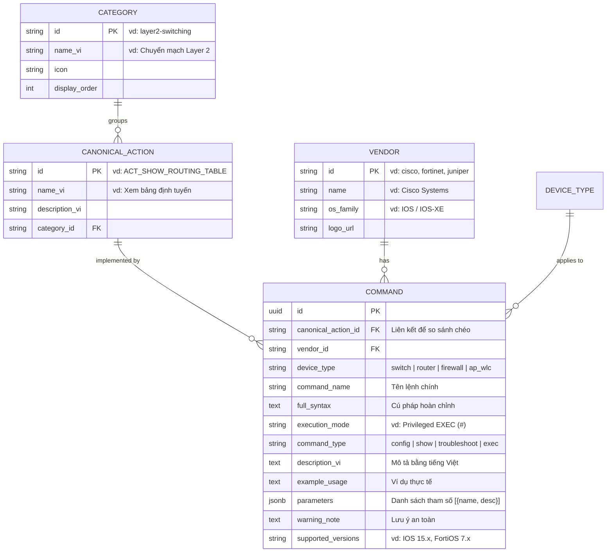

# Features Research: Network Command Lookup Tool

> **Tài liệu nghiên cứu các tính năng cốt lõi, nâng cao và cấu trúc dữ liệu cho công cụ tra cứu lệnh thiết bị mạng đa hãng (Cisco, Fortinet, Juniper, Palo Alto, MikroTik, Aruba/HPE, Huawei).**  
> *Dựa trên phân tích các công cụ thực tế: Cisco Command Lookup Tool, Packet Life Cheat Sheets, NetworkLessons CLI Reference, IPCisco, CBT Nuggets Cross-Vendor Matrices.*

---

## Table Stakes (Tính năng bắt buộc phải có)

Những tính năng người dùng (Kỹ sư mạng, Quản trị hệ thống, Kỹ thuật viên NOC/SOC) mặc định kỳ vọng khi mở một công cụ tra cứu lệnh. Nếu thiếu hoặc làm kém, người dùng sẽ lập tức quay lại Google search hoặc tài liệu PDF rời rạc.

### 1. Tìm kiếm Full-Text tức thì (Instant Omnisearch)
* **Tìm kiếm theo cú pháp lệnh:** Nhập lệnh đầy đủ hoặc lệnh rút gọn (ví dụ: `show ip int br`, `conf t`, `get router info`, `display ip int`).
* **Tìm kiếm theo ý định / chức năng (Intent-based Search bằng tiếng Việt):** Tìm bằng ngôn ngữ tự nhiên tiếng Việt (ví dụ: "cấu hình cổng trunk", "tạo vlan", "định tuyến tĩnh", "xem bảng arp", "xóa session").
* **Tìm kiếm theo giao thức & từ khóa:** OSPF, BGP, NAT, ACL, DHCP, LACP, STP, VRRP, IPsec, VXLAN.
* **Tốc độ phản hồi:** Kết quả hiển thị tức thì (< 100ms) qua client-side caching hoặc Supabase PostgreSQL text search (`tsvector` / `pg_trgm` unaccent).

### 2. Định dạng lệnh chuẩn xác & Copy 1-Click thông minh
* **Nút 1-Click Copy:** Copy toàn bộ lệnh hoặc đoạn script mẫu vào clipboard với hiệu ứng toast thông báo ("Đã sao chép").
* **Tách biệt Prompt khỏi lệnh:** Ký hiệu dấu nhắc lệnh (Prompt) như `Router#`, `Switch(config)#`, `[edit]`, `admin@PA-500>` phải là `select-none` để khi bôi đen hoặc bấm nút Copy không bị dính prompt vào CLI của thiết bị.
* **Cú pháp đầy đủ & Placeholder chuẩn:** Phân biệt rõ giữa từ khóa cố định (`set`, `interface`) và biến số người dùng cần thay thế (như `<interface_id>`, `<vlan_id>`, `<ip_address>/<mask>`).

### 3. Ngữ cảnh thực thi (Execution Mode / CLI Context)
* **Vị trí gõ lệnh rõ ràng:** Chỉ rõ lệnh phải chạy ở chế độ nào:
  * **Cisco:** User EXEC (`>`), Privileged EXEC (`#`), Global Config `(config)#`, Interface Config `(config-if)#`, Router Config `(config-router)#`.
  * **Juniper:** Operational Mode (`user@host>`), Configuration Mode (`[edit]`), Hierarchy level (`[edit interfaces ge-0/0/0]`).
  * **Fortinet:** Global `config system`, Table context `config system interface -> edit <port>`, `diagnose`, `get`, `execute`.
  * **Palo Alto:** Operational mode (`>`), Configuration mode (`#`), `request`, `test`.
  * **Huawei:** User View (`<Huawei>`), System View (`[Huawei]`), Interface View (`[Huawei-GigabitEthernet0/0/1]`).
  * **MikroTik:** Menu path (`/ip address`, `/ip route`, `/interface wireless`).

### 4. Hệ thống Filter đa chiều (Multi-Facet Filtering)
* **Lọc theo Hãng (Vendor):** Cisco (IOS/IOS-XE, NX-OS), Fortinet (FortiOS), Juniper (Junos), Palo Alto (PAN-OS), MikroTik (RouterOS), Aruba/HPE (AOS-S/AOS-CX/Comware), Huawei (VRP).
* **Lọc theo Loại thiết bị (Device Type):** Switch (L2/L3), Router, Firewall (NGFW), Access Point / Wireless Controller (AP/WLC).
* **Lọc theo Nhóm chức năng (Category):** System & Management, Layer 2 Switching, Layer 3 Routing, Security & Firewall, VPN, High Availability, Troubleshooting & Diagnostics.

### 5. Cấu trúc chi tiết lệnh (Command Detail View)
Mỗi lệnh khi mở chi tiết phải cung cấp đủ các trường thông tin:
* **Tên & Cú pháp lệnh:** Cú pháp chuẩn.
* **Mô tả chi tiết (Tiếng Việt):** Giải thích rõ mục đích lệnh, cơ chế hoạt động, giá trị mặc định (default behavior).
* **Ví dụ thực tế (Practical Example):** Ít nhất 1 kịch bản cấu hình thực tế với các tham số mẫu.
* **Giải thích tham số / Options:** Bảng mô tả các flag/tùy chọn quan trọng (ví dụ: `brief`, `detail`, `summary`, `extensive`).
* **Lưu ý & Cảnh báo an toàn (Safety Warnings):** Cảnh báo lệnh nguy hiểm gây gián đoạn dịch vụ (ví dụ: `reload`, `debug all`, `write erase`, `shutdown`, `clear session`).

---

## Differentiators (Tính năng tạo lợi thế cạnh tranh)

Những tính năng vượt trội so với các cheat sheet tĩnh dạng PDF hoặc các trang doc đơn thuần của từng hãng riêng lẻ.

### 1. Ma trận so sánh lệnh chéo hãng (Cross-Vendor Command Comparison)
* **So sánh song song (Side-by-Side Comparison):** Cho phép chọn một thao tác (ví dụ: "Xem bảng định tuyến") và hiển thị đồng thời lệnh tương ứng của tất cả các hãng:
  * Cisco: `show ip route`
  * Juniper: `show route`
  * Fortinet: `get router info routing-table all`
  * Palo Alto: `show routing route`
  * Huawei: `display ip routing-table`
  * MikroTik: `/ip route print`
* **Bộ chuyển đổi lệnh (CLI Translator Assistant):** Kỹ sư chuyên Cisco chuyển sang làm việc với Fortinet/Juniper chỉ cần nhập lệnh Cisco quen thuộc, tool tự động map sang lệnh tương đương của hãng đích.

### 2. Bộ tạo lệnh tùy biến tham số (Interactive Command Builder / Snippet Generator)
* Thay vì chỉ hiển thị `<vlan_id>` hay `<ip_address>`, cho phép người dùng nhập trực tiếp thông số vào form mini (VLAN ID: 100, Name: DATA, IP: 192.168.100.1/24).
* Tool tự động render ra đoạn lệnh hoàn chỉnh sẵn sàng paste thẳng vào console.

### 3. Phân loại theo mục đích vận hành (Show vs Config vs Troubleshoot)
* Giao diện cung cấp switch nhanh 3 chế độ vận hành:
  1. **Config (Cấu hình):** Các lệnh tạo mới, gán IP, bật tính năng (`set`, `config`, `ip route`).
  2. **Verify / Show (Kiểm tra trạng thái):** Các lệnh xem cấu hình, bảng trạng thái (`show`, `get`, `display`).
  3. **Troubleshoot / Debug (Sự cố & Bắt gói):** Các lệnh packet trace, log monitor, debug sâu (`diagnose debug flow`, `monitor traffic`, `test routing`).

### 4. Bảng Tra Cứu Nhanh Dạng PacketLife (Visual Cheat Sheet Grids)
* Ngoài tra cứu lẻ từng lệnh, cung cấp các trang tổng hợp dạng "Cheat Sheet 1 trang" chuyên sâu cho từng chủ đề (ví dụ: *BGP Troubleshooting Cheat Sheet*, *VLAN & Trunking Matrix*, *FortiGate CLI Debug Survival Guide*).

### 5. Quản lý Bookmark & Lệnh hay dùng (Saved / Favorite Commands)
* Cho phép kỹ sư lưu lại danh sách lệnh tủ theo từng dự án hoặc từng tác vụ thường làm (Onboarding switch mới, Cứu hộ sự cố mạng, Cấu hình VPN định kỳ).

### 6. Quản trị nội dung & Import hàng loạt (Admin Management & Bulk CSV/JSON Import)
* Hỗ trợ Admin/Kỹ sư nạp dữ liệu nhanh qua file CSV / JSON với schema chuẩn hóa.
* Giao diện thêm/sửa lệnh trực quan trên web mà không cần thao tác trực tiếp database.

---

## Anti-Features (Những tính năng KHÔNG NÊN làm)

Việc nhận diện rõ các anti-feature giúp dự án tập trung vào trải nghiệm tra cứu nhanh, ổn định, tránh phình to phạm vi (scope creep) và rủi ro bảo mật.

| Anti-Feature | Lý do KHÔNG làm | Thay thế bằng |
| :--- | :--- | :--- |
| **1. Kết nối SSH / Telnet / API trực tiếp vào thiết bị** | Rủi ro bảo mật nghiêm trọng (lộ credential, khóa SSH, tấn công trung gian), phức tạp hạ tầng (cần jump host, VPN vào mạng LAN của khách), ngoài phạm vi tra cứu. | Nút 1-Click Copy để người dùng tự paste vào PuTTY / SecureCRT / Terminal riêng. |
| **2. Tự động Scrape / Crawl tài liệu từ web hãng** | Tài liệu hãng (Cisco, Juniper, Fortinet) thay đổi DOM liên tục, có bot-block/login, dữ liệu crawl về rất nhiễu, sai lệch format, thiếu ngữ cảnh. | Quản lý dữ liệu bằng bộ import CSV/JSON được kiểm duyệt (curated) kỹ lưỡng. |
| **3. Trình giả lập CLI / Router Emulator ảo trên web** | Quá nặng, chi phí phát triển khổng lồ (tương đương viết lại GNS3/EVE-NG/Packet Tracer), không giải quyết nhu cầu tra cứu nhanh khi đang triển khai thực tế. | Cung cấp kịch bản ví dụ mẫu (Sample Output / Example Config) rõ ràng. |
| **4. Đa ngôn ngữ (i18n) tiếng Anh / Pháp / Trung** | Làm phân tán tài nguyên nội dung. Kỹ sư mạng Việt Nam cần thuật ngữ CLI tiếng Anh kết hợp mô tả / giải thích bằng tiếng Việt chuẩn xác. | Tập trung 100% vào tiếng Việt chất lượng cao cho phần mô tả và giữ nguyên syntax CLI tiếng Anh chuẩn. |
| **5. AI Sinh lệnh tự do (Unconstrained AI Generator)** | AI có thể bị ảo giác (hallucination), sinh ra cú pháp sai version dẫn đến sập hệ thống mạng production của khách hàng. | Dùng cơ sở dữ liệu lệnh đã được xác minh (deterministic, validated database), có thể gắn nhãn version hỗ trợ. |

---

## Organization Patterns (Cấu trúc & Tổ chức dữ liệu)

Để hỗ trợ khả năng tìm kiếm đa hãng, so sánh tương đương và lọc linh hoạt, cấu trúc dữ liệu lệnh cần được tổ chức theo mô hình **Canonical Action** (Hành động chuẩn) kết hợp với **Vendor Specific Implementation** (Lệnh cụ thể của từng hãng).

### 1. Mô hình Quan hệ Dữ liệu (Entity Relationship)



### 2. Phân cấp Danh mục & Nhóm chức năng (Category Taxonomy)

1. **System & Management (Hệ thống & Quản trị cơ bản):**
   * Hostname, Banner, Quản lý tài khoản (User, Password, Privilege).
   * Cấu hình SSH, Telnet, Console timeout.
   * NTP, Timezone, DNS, Syslog, SNMP.
   * Backup/Restore cấu hình, Lưu cấu hình (`write mem`, `commit`), Upgrade firmware, Khởi động lại (`reload`, `reboot`).
2. **Layer 2 / Switching (Chuyển mạch Layer 2):**
   * VLAN (Tạo VLAN, gán port Access/Trunk, Native VLAN, Voice VLAN).
   * Spanning Tree Protocol (STP, RSTP, MSTP, BPDU Guard, Root Guard).
   * Link Aggregation / Port Channel (LACP, PAgP, Static EtherChannel).
   * Bảng MAC (Xem, xóa, tìm port theo MAC), LLDP / CDP.
3. **Layer 3 / Routing (Định tuyến Layer 3):**
   * Cấu hình Interface IP, Sub-interface (Router-on-a-Stick), SVI / VLAN Interface.
   * Định tuyến tĩnh (Static Route, Default Route, Floating Static Route).
   * Dynamic Routing: OSPF (Single area, Multi-area, Passive interface, Router ID).
   * BGP (BGP Neighbor, AS number, Advertise network, Summary).
   * VRF (Virtual Routing and Forwarding).
4. **Security & Firewall Policies (Bảo mật & Tường lửa):**
   * Access Control List (Standard ACL, Extended ACL, Named ACL).
   * Firewall Policies / Rules (Source/Dest Zone, Address Objects, Service Objects).
   * NAT / PAT (Source NAT, Destination NAT / Port Forwarding, Static 1-to-1 NAT).
   * Port Security (Sticky MAC, Max MAC, Violation mode), DHCP Snooping, DAI.
5. **VPN & Remote Access:**
   * IPsec Site-to-Site VPN (Phase 1 IKE, Phase 2 IPsec, Proposals, Crypto Map/VTI).
   * Remote Access VPN (SSL-VPN, Client-to-Site).
   * GRE Tunnel.
6. **Services & High Availability (Dịch vụ & Dự phòng):**
   * DHCP Server & DHCP Relay Agent.
   * High Availability / Redundancy (HSRP, VRRP, FortiGate FGCP Cluster, Active-Standby).
7. **Troubleshooting, Diagnostics & Packet Inspection:**
   * Ping, Traceroute, Telnet port check.
   * Debug / Packet Flow Trace (`debug`, `diagnose debug flow`, `monitor traffic`).
   * SPAN / Port Mirroring.
   * Xem CPU, RAM, nhiệt độ, kiểm tra lỗi cổng (CRC errors, Drops).

---

## UX Patterns (Mô hình Trải nghiệm Người dùng)

### 1. Tìm kiếm & Điều hướng (Search & Navigation)
* **Thanh tìm kiếm trung tâm lớn (Command Hero Search):**
  * Tự động focus khi vào trang hoặc nhấn phím tắt `Ctrl + K` / `Cmd + K`.
  * Có gợi ý tìm kiếm nhanh bên dưới: `#VLAN`, `#BGP`, `#StaticRoute`, `#Troubleshoot`.
  * Xóa nhanh truy vấn với nút `Clear` (Esc).
* **Bộ lọc nhanh dạng Chip / Pill Tabs:**
  * Dòng 1: Chọn Hãng (All | Cisco | Fortinet | Juniper | Palo Alto | MikroTik | Huawei | Aruba).
  * Dòng 2: Loại thiết bị (All | Switch | Router | Firewall | AP/WLC).
  * Dòng 3: Loại lệnh (All | Cấu hình | Xem trạng thái | Khắc phục sự cố).

### 2. Trình bày Thẻ lệnh (Command Card Design)
Mỗi thẻ lệnh trong danh sách kết quả được thiết kế tối ưu cho việc đọc quét (scanning) nhanh:
* **Header thẻ:**
  * Logo/Badge Hãng (màu sắc nhận diện: Cisco xanh lam, Fortinet đỏ cam, Juniper xanh lá, Palo Alto cam).
  * Badge Loại thiết bị (Switch / Router / Firewall) & Chế độ thực thi (`#`, `>`, `[edit]`).
  * Badge Loại thao tác (`Config`, `Show`, `Troubleshoot`).
* **Khung Lệnh chính (CLI Code Block):**
  * Background đen/xám tối (`bg-slate-900` / `bg-gray-950`), chữ `font-mono` màu xanh lá pastel hoặc cyan sáng.
  * Nút Copy nổi bật góc trên bên phải với icon Clipboard + Tooltip "Copy".
  * Tô màu cú pháp (Syntax Highlight) phân biệt từ khóa lệnh và tham số.
* **Body thẻ:**
  * Mô tả ngắn gọn bằng tiếng Việt.
  * Nút "Xem chi tiết / Ví dụ mẫu" để mở rộng accordion hoặc drawer.
  * Nếu có lệnh tương đương ở hãng khác: Hiển thị liên kết nhanh "Xem bản dịch cho Fortinet / Juniper...".

### 3. Giao diện So sánh Đa hãng (Cross-Vendor Matrix View)
* **Chế độ xem lưới (Matrix Grid Mode):**
  * Hàng ngang: Các hành động / chức năng chuẩn (ví dụ: *Tạo VLAN*, *Gán IP cổng*, *Xem routing table*).
  * Các cột: Cisco | Fortinet | Juniper | Palo Alto.
  * Kỹ sư có thể nhìn tổng quan toàn bộ khác biệt cú pháp trong 1 màn hình.
* **Chế độ chuyển đổi 1-1 (1-to-1 CLI Converter):**
  * Cột trái: Chọn hãng nguồn (vd: Cisco IOS) -> Gõ lệnh.
  * Cột phải: Chọn hãng đích (vd: Fortinet FortiOS) -> Hiển thị ngay lệnh tương đương kèm ghi chú khác biệt về tư duy cấu hình (e.g. Fortinet tự động lưu, còn Cisco phải `write memory`).

### 4. Thiết kế Thân thiện với Kỹ sư Vận hành (Operational Friendly)
* **Dark Mode làm chủ đạo:** Kỹ sư mạng thường làm việc ban đêm hoặc nhìn màn hình terminal đen liên tục, giao diện tối giúp giảm mỏi mắt.
* **Responsive & Mobile/Tablet Ready:** Tối ưu hiển thị để kỹ sư có thể vừa cầm iPad / Điện thoại đứng tại tủ Rack trong phòng Data Center vừa tra cứu lệnh nhanh.
* **Callout Cảnh báo Nguy hiểm:** Các lệnh có khả năng gây rớt mạng hoặc mất cấu hình được đóng khung màu vàng/đỏ viền sáng rõ ràng kèm icon `AlertTriangle`.

---

## Kế hoạch Cấu trúc Dữ liệu & CSV Import

Để đáp ứng yêu cầu import dữ liệu hàng loạt từ file CSV/JSON, cấu trúc mẫu định dạng CSV chuẩn cần có các cột:

```csv
canonical_action_id,vendor,device_type,command_name,full_syntax,execution_mode,command_type,description_vi,example_usage,parameters_json,warning_note,supported_versions
ACT_SHOW_ROUTING,cisco,router,show ip route,show ip route [protocol | rip | ospf | bgp | static],Privileged EXEC (#),show,Hiển thị bảng định tuyến IP hiện tại của router,show ip route ospf,"[{""name"":""ospf"",""desc"":""Chỉ lọc các route học qua OSPF""}]",,IOS 12.x+ / IOS-XE
ACT_SHOW_ROUTING,fortinet,firewall,get router info routing-table,get router info routing-table all,Global,show,Xem toàn bộ bảng định tuyến của FortiGate,get router info routing-table all,"[{""name"":""all"",""desc"":""Hiển thị tất cả route đang active""}]",,FortiOS 6.x / 7.x
ACT_SHOW_ROUTING,juniper,router,show route,show route [destination | protocol <name>],Operational (>),show,Hiển thị bảng định tuyến của Junos (inet.0),show route protocol ospf,"[{""name"":""protocol"",""desc"":""Lọc theo giao thức định tuyến""}]",,Junos OS 18.x+
```

---

## Kết luận & Đề xuất cho Roadmap Thực hiện

1. **Giai đoạn 1 (Nền tảng & Tra cứu cơ bản):**
   * Thiết kế bảng Database trên Supabase (`categories`, `canonical_actions`, `commands`, `vendors`).
   * Xây dựng giao diện trang `/tools` với Search bar, Filter theo Vendor / Device Type / Category.
   * Thẻ lệnh với 1-Click Copy và hiển thị ngữ cảnh thực thi.
2. **Giai đoạn 2 (So sánh chéo & Import dữ liệu):**
   * Tính năng so sánh lệnh chéo hãng theo `canonical_action_id`.
   * Form thêm lệnh mới qua UI cho Admin.
   * Chức năng Import / Export dữ liệu bằng file CSV / JSON.
3. **Giai đoạn 3 (Tối ưu hóa & Nội dung chuyên sâu):**
   * Nạp đầy đủ bộ dữ liệu cơ bản cho 7 hãng (Cisco, Fortinet, Juniper, Palo Alto, MikroTik, Huawei, Aruba).
   * Xây dựng các trang Cheat Sheet chuyên đề (OSPF, BGP, VLAN/Trunk, Debug).
   * Tính năng Bookmark / Favorite commands cho người dùng đã đăng nhập.
